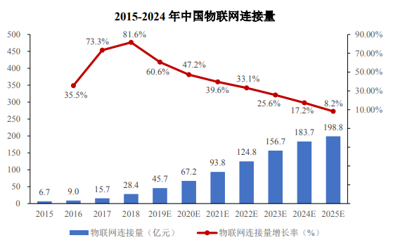
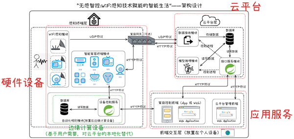

# 无感智控:WiFi感知技术赋能的智能生活

## 项目简介

在AIoT（人工智能物联网）技术迅猛发展的时代背景下，智能感知正从"万物互联"向"无感智能"演进。传统传感器方案存在设备依赖性强、隐私泄露风险高、部署维护成本大等痛点，难以满足现代智慧建筑对无缝交互和隐私保护的双重需求。本作品创新性地构建了"端-边-云"协同的WiFi无接触感知系统，通过AI驱动的信号处理与Web可视化技术，打造了"环境-人体-行为"三位一体的智能空间交互平台，为智慧建筑提供全时域、非侵入式的人员感知解决方案。这种无接触感知方式不仅避免了传统摄像头或穿戴设备对用户隐私的潜在威胁，还突破了传统传感器在安装和维护上的局限性，实现了真正意义上的“无感”交互。

图1 中国物联网连接发展趋势

系统采用"硬件设备-云平台-应用服务"三层AIoT架构，相较于传统方案，本系统具有三大创新优势：无感化感知，利用环境WiFi信号实现非侵入式检测，避免摄像头带来的隐私问题；自适应性，基于深度学习的信号增强算法可抵抗多径干扰，适用于复杂室内环境；成本效益，复用现有WiFi基础设施，部署成本降低70%以上。

图2 "硬件设备-云平台-应用服务"三层AIoT架构

通过分析WiFi信号的变化，精准检测区域内人员信息，并将其转化为直观可视化的Web界面。平台涵盖家电智控、智慧安防、智能门锁等多个应用场景，实现“有人开启，无人关闭”的智能家电控制、异常入侵预警、以及低功耗模式自动切换等功能。旨在探索WiFi感知技术在实际生活中的无限可能，打造无感、便捷的智能生活体验。用户可以通过浏览器实时查看区域内的人员分布、活动轨迹以及设备状态，实现“所见即所得”的智能管理。同时，平台采用模块化设计，支持灵活扩展，能够根据不同场景需求快速定制功能，为智慧建筑提供全方位的解决方案。
未来，随着WiFi感知技术的进一步发展，平台可以接入更多应用场景，比如久坐监控，工位监测等。通过不断优化算法和提升感知精度，本作品旨在推动无感交互技术的普及，为人们带来更加智能、便捷、安全的生活体验，真正实现“科技融入生活，感知无处不在”的愿景。

## 相关项目

[模型训练CSI-aboutmodel](https://github.com/xiaohan2004/CSI-aboutmodel)

[云平台后端CSI-csiapi](https://github.com/xiaohan2004/CSI-csiapi)

[模型后端CSI-modelbackend](https://github.com/xiaohan2004/CSI-modelbackend)

[守护进程CSI-daemon](https://github.com/xiaohan2004/CSI-daemon)

## 效果展示

[作品展示——无感智控:WiFi感知技术赋能的智能生活](https://www.bilibili.com/video/BV1xaocYFEQp)
